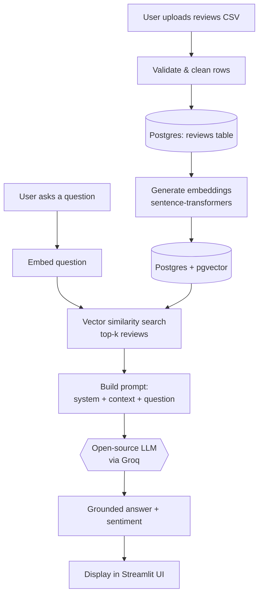

# Implementation Plan — AI Customer Review Analyzer

> **How to use this document:** This is a *learning roadmap*, not a finished
> application. Build one component at a time, stop at each checkpoint, test,
> and make sure you understand it before moving on. Adjust anything that does
> not fit your real requirements.

---

## Assumptions I Made (Review & Correct These)

Because a few details were not specified, I assumed the following. Change them
if they are wrong:

1. **Experience level:** Intermediate (comfortable with Python functions, pip,
   and the command line; newer to LLMs and databases).
2. **Application format:** **Streamlit** (fast to build, great for demos). The
   plan notes where a FastAPI/CLI alternative would fit.
3. **Environment:** macOS with 8–16 GB RAM (based on your workspace path).
4. **LLM access:** **Groq API is the active provider** (it serves *open-source*
   models like Llama 3 / Llama 3.1 via a fast free tier). **OpenAI key is kept
   but commented out** as a fallback.
5. **"Postgres for RAG"** means Postgres + the **`pgvector`** extension to store
   review embeddings for retrieval-augmented generation.

> ⚠️ **A note on your course rules:** The CAP 942 prompt says "open-source LLM"
> and "no paid APIs." Groq is a *hosted API* but it **runs open-source models**
> and has a **free tier**, so it fits the spirit of the requirement. If your
> instructor requires a *locally run* model, swap Groq for **Ollama** (see the
> Technology Stack section — the rest of the plan stays the same). **Confirm
> this with your instructor before you build.**

---

## 1. Project Title

**AI Customer Review Analyzer** — a retrieval-augmented tool that summarizes
customer sentiment, surfaces themes, and answers natural-language questions
about a product's reviews.

---

## 2. Project Summary

The AI Customer Review Analyzer ingests a set of customer reviews, stores them
in a Postgres database with vector embeddings, and lets a user ask plain-English
questions (e.g., *"What do customers complain about most?"*). It retrieves the
most relevant reviews and uses an open-source LLM (via Groq) to produce a
grounded summary, a sentiment breakdown, and key themes.

**Value proposition:** *Turn hundreds of scattered customer reviews into clear,
evidence-backed answers in seconds.*

---

## 3. Problem Statement

- **Problem:** Businesses receive more reviews than any person can read, and raw
  star ratings hide *why* customers are happy or unhappy.
- **Why it matters:** Missing recurring complaints (shipping, quality, support)
  leads to lost customers; missing praise hides what's working.
- **Intended users:** Small-business owners, product managers, and support leads
  who need quick, grounded insight without a data-science team.

---

## 4. Capstone Requirement Alignment

> Replace the left column with the **exact wording** from your CAP 942 rubric.
> I used common capstone requirements as placeholders.

| Capstone Requirement | How the App Will Meet It | Evidence / Deliverable |
|---|---|---|
| Uses an open-source LLM | Llama 3.x served via Groq (or Ollama locally) | `llm_client.py` + config showing the model name |
| Solves a real problem | Summarizes/queries customer reviews | Demo + problem statement |
| Takes and validates user input | Review upload + question box with validation | `input validation` tests |
| Uses a data store | Postgres + `pgvector` for RAG | Schema file + seeded DB screenshot |
| Demonstrates prompt engineering | System prompt + templated user prompt | `prompts.py` + Prompt-Engineering section |
| Handles errors gracefully | Try/except around API, DB, file I/O | Error-handling tests |
| Includes testing | Unit + end-to-end tests | `tests/` folder + passing run |
| Documented on GitHub | README with setup/run/examples | Public repo |
| Presented live | 5–10 min demo | Slides + recording |

---

## 5. Project Scope

### MVP Features (build these first)
1. Load reviews from a **CSV file** into Postgres.
2. Generate and store **embeddings** for each review (`pgvector`).
3. **Retrieve** the top-k relevant reviews for a user question (vector search).
4. Send retrieved reviews + question to the **LLM** and return a grounded answer.
5. Simple **UI** (Streamlit): upload CSV, ask a question, see the answer.
6. **Input validation** and **error handling**.

### Out of Initial Scope
- Live scraping of review sites (legal/ToS issues).
- User accounts / authentication.
- Multi-tenant or multi-product dashboards.
- Fine-tuning or training any model.

### Optional Enhancements (only after MVP works)
- Sentiment chart (positive/neutral/negative counts).
- Theme clustering / tag extraction.
- Export results to PDF/CSV.
- Switch provider toggle (Groq ↔ Ollama ↔ OpenAI).

---

## 6. Recommended Technology Stack

| Layer | Choice | Why |
|---|---|---|
| Open-source LLM | **Llama 3.1 8B Instruct** (via Groq) | Strong, free-tier, fast; open weights |
| Model runner | **Groq API** (active) · **Ollama** (local fallback) | Groq = no local GPU needed; Ollama = fully local/offline |
| Embeddings | **`sentence-transformers` (all-MiniLM-L6-v2)** | Runs locally & free; good quality/size balance |
| Database | **PostgreSQL + `pgvector`** | Stores reviews + vectors; required for RAG |
| DB driver | **`psycopg[binary]`** | Modern Postgres driver for Python |
| App framework | **Streamlit** | Fastest path to a demo UI |
| Env/secrets | **`python-dotenv`** | Loads API keys from `.env` |
| Dependency mgmt | **`uv`** | Fast, reproducible Python project/venv management |
| Testing | **`pytest`** | Standard, simple |
| Data handling | **`pandas`** | Read/clean CSV reviews |

**Hardware considerations:** Embeddings with MiniLM run fine on CPU/8 GB RAM.
Groq offloads the heavy LLM work to the cloud, so your machine stays light. If
you must run the LLM locally with limited RAM, use a **smaller Ollama model**
(e.g., `llama3.2:3b` or `phi3:mini`).

**`uv` quick start (run in terminal — don't paste blindly, understand each line):**
```bash
uv init                      # create project + pyproject.toml
uv add streamlit psycopg[binary] pgvector sentence-transformers \
       python-dotenv pandas groq pytest
uv run streamlit run app.py  # later, once app.py exists
```

---

## 7. Application Workflow

Flow from input to output:

1. User uploads a **CSV of reviews** (or uses a seeded sample).
2. App **cleans/validates** rows and inserts them into Postgres.
3. App **embeds** each review and stores vectors in `pgvector`.
4. User types a **question**.
5. App embeds the question and runs a **vector similarity search** to get top-k
   relevant reviews (**Retrieval**).
6. Retrieved reviews + question go into a **prompt** → **LLM (Groq)** generates a
   grounded answer (**Generation**). ← *this is where the open-source LLM is used*
7. UI displays the **answer** plus the supporting reviews.



---

## 8. Application Architecture

| Component | Responsibility | Errors handled here |
|---|---|---|
| `ui` (Streamlit) | Collect input, show results | Invalid uploads, empty questions |
| `ingest` | Read CSV, validate, insert reviews | Bad/missing columns, empty files |
| `embeddings` | Turn text into vectors | Model load failure |
| `db` | Connect to Postgres, run queries/search | Connection/query failures |
| `retriever` | Vector search → top-k reviews | No results found |
| `llm_client` | Call Groq (or fallback), return text | API/network/rate-limit errors |
| `prompts` | Build system + user prompts | — |
| `config` | Load `.env`, choose provider | Missing keys |

**Information flow:** `ui → ingest → db/embeddings` (one time), then
`ui → retriever → db` → `prompts → llm_client → ui`.

**Error strategy:** Each component raises clear exceptions; the `ui` layer
catches them and shows a friendly message instead of crashing.

---

## 9. Proposed Project Structure

```
AI_Customer_Review_Analyzer/
├── app.py                 # Streamlit entry point (you build this LAST)
├── pyproject.toml         # uv-managed dependencies
├── .env                   # GROQ_API_KEY=... (and commented OPENAI key) — gitignored
├── .env.example           # template showing required keys (no secrets)
├── .gitignore
├── README.md
├── data/
│   └── sample_reviews.csv # small sample dataset for testing
├── src/
│   ├── config.py          # load env vars, pick active provider
│   ├── db.py              # Postgres connection + schema helpers
│   ├── ingest.py          # CSV -> validated rows -> DB
│   ├── embeddings.py      # text -> vectors
│   ├── retriever.py       # vector search for top-k reviews
│   ├── prompts.py         # system + user prompt templates
│   └── llm_client.py      # call Groq; OpenAI fallback (commented)
├── sql/
│   └── schema.sql         # CREATE EXTENSION vector; CREATE TABLE reviews ...
└── tests/
    ├── test_ingest.py
    ├── test_retriever.py
    └── test_llm_client.py
```

**Purpose notes:** keep logic in `src/` so each piece is testable in isolation;
`app.py` only wires components together. **Do not** put database or API logic
inside `app.py`.

---

## 10. Step-by-Step Development Milestones

> Build the smallest working piece first. Stop and test at every checkpoint.

### Milestone 0 — Project Setup
- **Learning objective:** Reproducible Python project with `uv` and secrets.
- **Review:** virtual environments, `.env` files, `.gitignore`.
- **Tasks:** `uv init`; add deps; create `.env` + `.env.example`; `git init`.
- **Exercise:** Print `GROQ_API_KEY` length (not the key!) to confirm it loads.
- **Testing checkpoint:** `uv run python -c "import streamlit, psycopg, groq"`.
- **Acceptance:** Deps install; env var loads; repo initialized.
- **Common mistakes:** Committing `.env`; wrong Python version.
- **What I build myself:** `config.py` that reads the active provider.
- **How I'll know it works:** No import errors; key length prints.

### Milestone 1 — Database & Schema
- **Learning objective:** Postgres + `pgvector` basics.
- **Review:** tables, `CREATE EXTENSION vector`, connecting from Python.
- **Tasks:** Install Postgres + pgvector; write `sql/schema.sql`; connect in `db.py`.
- **Exercise:** Insert one hard-coded review row and read it back.
- **Testing checkpoint:** `SELECT count(*) FROM reviews;` returns 1.
- **Acceptance:** You can connect, create the table, insert, and query.
- **Common mistakes:** Forgetting the `vector` extension; wrong connection string.
- **What I build myself:** `schema.sql` and `db.get_connection()`.
- **How I'll know it works:** Row round-trips successfully.

### Milestone 2 — Ingest CSV Reviews
- **Learning objective:** Validate and load external data.
- **Review:** pandas, data validation, bulk insert.
- **Tasks:** Read CSV, check required columns, drop empties, insert rows.
- **Exercise:** Reject a CSV missing a `review_text` column with a clear message.
- **Testing checkpoint:** Load `sample_reviews.csv`; count matches file rows.
- **Acceptance:** Valid CSV loads; invalid CSV is rejected gracefully.
- **Common mistakes:** Assuming columns exist; inserting NaN.
- **What I build myself:** `ingest.load_reviews(path)`.
- **How I'll know it works:** DB count equals valid rows.

### Milestone 3 — Embeddings
- **Learning objective:** Convert text to vectors and store them.
- **Review:** sentence-transformers, vector dimensions.
- **Tasks:** Embed each review; store the vector column; add a vector index.
- **Exercise:** Print the embedding length (should be a fixed number, e.g. 384).
- **Testing checkpoint:** Every review has a non-null embedding.
- **Acceptance:** Embeddings generated and stored for all rows.
- **Common mistakes:** Dimension mismatch between model and column.
- **What I build myself:** `embeddings.embed(text)`.
- **How I'll know it works:** No null vectors; dimensions match schema.

### Milestone 4 — Retriever (Vector Search)
- **Learning objective:** Retrieve top-k relevant reviews.
- **Review:** cosine distance, `ORDER BY embedding <=> query LIMIT k`.
- **Tasks:** Embed the question; run similarity search; return rows.
- **Exercise:** For a test question, print the top-3 returned review snippets.
- **Testing checkpoint:** Results are topically relevant to the question.
- **Acceptance:** Returns k ordered, relevant reviews.
- **Common mistakes:** Forgetting to embed the query the same way as reviews.
- **What I build myself:** `retriever.search(question, k)`.
- **How I'll know it works:** Relevant reviews rank highest.

### Milestone 5 — LLM Client (Groq)
- **Learning objective:** Call an open-source model via Groq.
- **Review:** API clients, request/response, error handling.
- **Tasks:** Send a prompt, return text; add try/except; keep OpenAI commented.
- **Exercise:** Ask the model to say "hello" and print the response.
- **Testing checkpoint:** A real response returns; a forced error is caught.
- **Acceptance:** `llm_client.generate(prompt)` returns text or a clear error.
- **Common mistakes:** Hard-coding keys; not handling rate limits.
- **What I build myself:** `llm_client.generate()`.
- **How I'll know it works:** Prints a model reply; errors don't crash.

### Milestone 6 — RAG Glue + Prompts
- **Learning objective:** Combine retrieval + generation.
- **Review:** prompt templates, grounding context.
- **Tasks:** Build the prompt from retrieved reviews; call LLM; return answer.
- **Exercise:** Compare an answer *with* vs *without* retrieved context.
- **Testing checkpoint:** Answer references facts from the reviews.
- **Acceptance:** Grounded answer produced end-to-end (no UI yet).
- **Common mistakes:** Context too long; no instruction to stay grounded.
- **What I build myself:** `prompts.build_prompt()` + glue function.
- **How I'll know it works:** Answer cites actual review content.

### Milestone 7 — Streamlit UI (build last)
- **Learning objective:** Wire components into a usable app.
- **Review:** Streamlit widgets, session state.
- **Tasks:** CSV upload, question box, show answer + supporting reviews.
- **Exercise:** Add a spinner while the LLM responds.
- **Testing checkpoint:** Full flow works from the browser.
- **Acceptance:** Non-technical user can run a query end-to-end.
- **Common mistakes:** Putting DB/LLM logic in `app.py`.
- **What I build myself:** `app.py` wiring only.
- **How I'll know it works:** Upload → ask → grounded answer appears.

---

## 11. Guided Code Examples

> These are **isolated concept demos** — intentionally **not** connected into a
> finished app. Each has a `TODO` you must complete.

### Example 1 — Validate user input
```python
# Goal: reject empty or too-short questions before doing expensive work.
def validate_question(q: str) -> str:
    q = (q or "").strip()          # handle None and extra spaces
    if len(q) < 5:                 # pick a sensible minimum length
        raise ValueError("Question is too short.")
    # TODO: also reject questions longer than a max length you choose
    return q

print(validate_question("What do customers dislike?"))
```
**Explanation:** Guard clauses stop bad input early and give clear errors.
**Practice task:** Add a maximum-length check and a test for it.

### Example 2 — Load one secret from `.env`
```python
import os
from dotenv import load_dotenv      # pip/uv: python-dotenv

load_dotenv()                       # reads variables from a local .env file
key = os.getenv("GROQ_API_KEY")     # never hard-code secrets in code
if not key:
    raise RuntimeError("GROQ_API_KEY is missing. Add it to .env")
print("Key loaded, length:", len(key))   # print length, NOT the key
# TODO: also read an ACTIVE_PROVIDER variable ("groq" or "openai")
```
**Explanation:** Secrets live in `.env` (gitignored), not in source.
**Practice task:** Add `ACTIVE_PROVIDER` and default it to `"groq"`.

### Example 3 — Call the LLM via Groq
```python
from groq import Groq               # Groq serves open-source models (Llama)

client = Groq()                     # reads GROQ_API_KEY from the environment

def ask_llm(prompt: str) -> str:
    resp = client.chat.completions.create(
        model="llama-3.1-8b-instant",            # an open-source model
        messages=[{"role": "user", "content": prompt}],
    )
    return resp.choices[0].message.content       # extract just the text
    # TODO: add a system message to control tone and grounding

print(ask_llm("Say hello in one short sentence."))
```
**Explanation:** The client sends messages and returns the model's text.
**Practice task:** Add a `system` message instructing it to be concise.

### Example 4 — A reusable prompt builder
```python
def build_prompt(question: str, reviews: list[str]) -> str:
    # Join retrieved reviews into a context block the model can ground on
    context = "\n".join(f"- {r}" for r in reviews)
    return (
        "Answer ONLY using the reviews below. "
        "If the answer isn't there, say you don't know.\n\n"
        f"Reviews:\n{context}\n\nQuestion: {question}"
    )
    # TODO: add an instruction to include a short sentiment summary

print(build_prompt("Main complaint?", ["Shipping was slow", "Great quality"]))
```
**Explanation:** Grounding instructions reduce made-up answers.
**Practice task:** Add a line asking for a positive/negative count.

### Example 5 — Handle one common error (API failure)
```python
from groq import Groq

def safe_generate(prompt: str) -> str:
    try:
        client = Groq()
        resp = client.chat.completions.create(
            model="llama-3.1-8b-instant",
            messages=[{"role": "user", "content": prompt}],
        )
        return resp.choices[0].message.content
    except Exception as e:                 # catch network/rate-limit/auth errors
        # TODO: log the error type and return a user-friendly fallback message
        return "Sorry, the analyzer is unavailable right now."

print(safe_generate("Summarize: product is great but late."))
```
**Explanation:** Wrapping external calls keeps the app from crashing.
**Practice task:** Return different messages for auth vs. rate-limit errors.

---

## 12. Prompt-Engineering Plan

- **System prompt purpose:** Force the model to stay **grounded** in retrieved
  reviews, stay concise, and admit when it doesn't know.
- **User-provided info:** the question + (behind the scenes) the top-k reviews.
- **Expected response format:** a short answer, a 3–5 bullet theme list, and a
  one-line sentiment summary.
- **Example template (with placeholders):**
  ```
  SYSTEM: You are a review-analysis assistant. Use ONLY the provided reviews.
  If the reviews don't cover it, say "Not enough information." Be concise.

  USER:
  Reviews:
  {{retrieved_reviews}}

  Question: {{user_question}}

  Respond with:
  1) A direct answer
  2) Up to 5 key themes
  3) Overall sentiment (positive / mixed / negative)
  ```
- **Reducing bad responses:** require grounding, limit context length, lower
  temperature, and add "say you don't know" instructions.

---

## 13. Testing Plan

### Component tests
- `ingest`: valid CSV loads; missing column rejected; empty file rejected.
- `retriever`: returns k results; returns empty cleanly when DB is empty.
- `llm_client`: returns text on success; returns fallback on forced error.

### End-to-end
- Upload sample CSV → ask a question → receive a grounded answer in the UI.

### Five realistic test cases

| # | Input | Expected Behavior |
|---|---|---|
| 1 | "What do customers like most?" | Themes grounded in positive reviews |
| 2 | "What are the top complaints?" | Themes grounded in negative reviews |
| 3 | Question unrelated to data ("What's the weather?") | "Not enough information." |
| 4 | Empty question | Validation error, no LLM call |
| 5 | CSV missing `review_text` column | Clear rejection message |

### Invalid-input / error tests
- No `GROQ_API_KEY` → clear setup error.
- DB offline → friendly "database unavailable" message.
- Oversized question → rejected by validation.

### Evaluating LLM output quality (simple method)
Keep a small spreadsheet of 5–10 questions with "expected themes." For each run,
mark **grounded? (y/n)**, **relevant? (y/n)**, **hallucination? (y/n)**. Track
the pass rate as you tweak prompts.

---

## 14. Privacy, Security, Accessibility, and Responsible-AI

- **Risks:** reviews may contain personal info; LLMs can hallucinate; biased
  conclusions from skewed samples.
- **Limitations:** only as good as the uploaded reviews; not a statistically
  valid survey.
- **Mitigations:** keep keys in `.env`; don't log raw reviews with PII; ground
  answers in retrieved text; show the supporting reviews so users can verify;
  use readable fonts/labels and alt text for charts (accessibility).
- **Claims to avoid:** Don't claim the tool gives "100% accurate sentiment,"
  "legal/medical advice," or "guaranteed business outcomes."

---

## 15. Documentation and GitHub Plan

**README sections:** Overview · Features · Architecture diagram · Prerequisites ·
Setup (`uv`, Postgres, `.env`) · Running the app · Example input/output ·
Testing · Limitations · License.

**Setup instructions:** install `uv`, run `uv sync`, create Postgres DB + enable
`pgvector`, copy `.env.example` → `.env`, add `GROQ_API_KEY`.

**Dependency docs:** list from `pyproject.toml`; explain each major library.

**Run instructions:** `uv run streamlit run app.py`.

**Example inputs/outputs:** include `data/sample_reviews.csv` and a screenshot of
a question + grounded answer.

**GitHub submission checklist:**
- [ ] `.env` is gitignored; `.env.example` committed
- [ ] README complete with screenshots
- [ ] `sql/schema.sql` included
- [ ] Tests pass (`uv run pytest`)
- [ ] Sample data included
- [ ] License file added

---

## 16. Presentation Plan (5–10 min)

1. **Problem** (1 min) — why reading all reviews is hard.
2. **Solution overview** (1 min) — what the app does.
3. **Workflow diagram** (1 min) — show the Mermaid flow + where the LLM is used.
4. **Live demo** (3–4 min): upload CSV → ask "top complaints?" → show grounded
   answer + supporting reviews → ask an unrelated question to show "I don't know."
5. **Challenges & lessons** (1 min) — e.g., keeping answers grounded, pgvector setup.
6. **Next steps** (1 min) — sentiment charts, provider toggle, export.

---

## 17. Suggested Timeline

| Session | Focus | Done when… |
|---|---|---|
| 1 | Milestone 0–1: setup + DB/schema | Row round-trips in Postgres |
| 2 | Milestone 2–3: ingest + embeddings | All reviews embedded |
| 3 | Milestone 4–5: retriever + LLM client | Top-k search + LLM reply work |
| 4 | Milestone 6: RAG glue + prompts | Grounded answer end-to-end (no UI) |
| 5 | Milestone 7: Streamlit UI | Full browser flow works |
| 6 | Tests + README + polish | Tests pass, docs complete |
| 7+ | Optional enhancements | Only after MVP is solid |

---

## 18. Definition of Done

- [ ] MVP features (Section 5) all work end-to-end
- [ ] Open-source LLM used via Groq (OpenAI kept commented as fallback)
- [ ] Postgres + `pgvector` RAG retrieval working
- [ ] Input validation + error handling in place
- [ ] ≥5 test cases pass, including invalid-input tests
- [ ] Prompt grounds answers and admits "don't know"
- [ ] README with setup, run, and example I/O
- [ ] `.env` secured; `.env.example` provided
- [ ] Public GitHub repo matches submission checklist
- [ ] Presentation + live demo rehearsed
- [ ] Every rubric item in Section 4 has evidence
- [ ] I understand each component well enough to explain it

---

### ✅ Reminder
This plan is a **starting point**. Review each section, confirm the Groq-vs-local
question with your instructor, and write the application **one component at a
time**, testing as you go. Bring this file to your capstone meeting.
